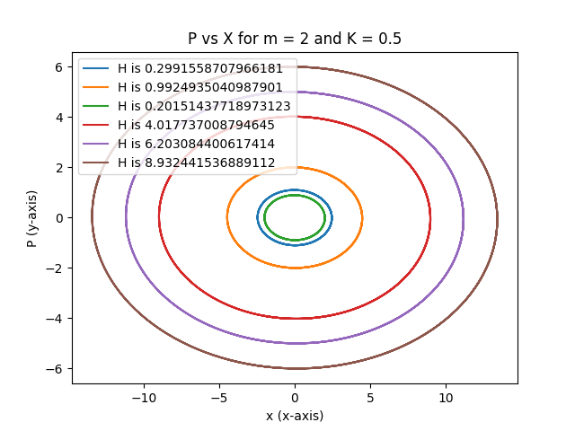
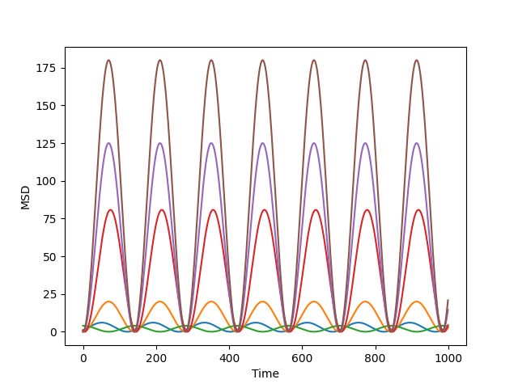

# Phase space trajectory of a 1D harmonic oscillator

**Execute code:**

```
    python code.py
```

**output :**

2 graphs as shown in `Report.py`

According to Hamilton's equation for H(x, P):
* dP/dt = - dH/dx
* dx/dt = dH/dp

Therefore for given, H(x, P) = Kx<sup>2</sup>/2 + P<sup>2</sup>/2m

**Time Evolution of P & x are:**

* dP/dt = -Kx
* dx/dt = P/m


## Phase space Graph (P vs x): 



## Mean Square Displacement Vs Time:

