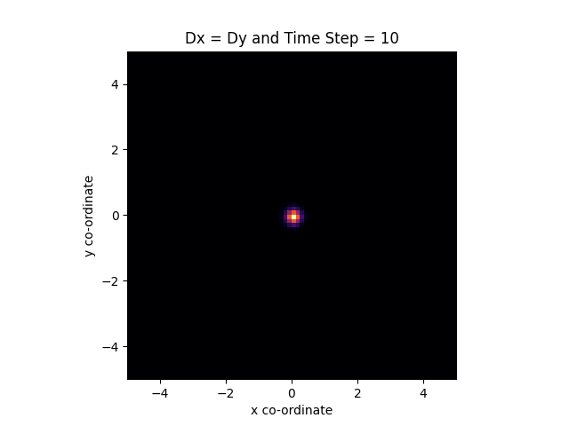
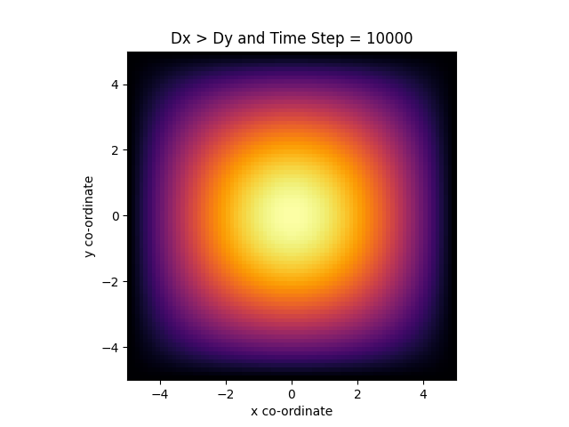

# Numerical Solution of Diffusion equation  

Table of Content:
* How to Run
* 1-D Eq. & Solution
* 2-D Eq. & Solution
* 2D density plots for time steps= 10, 100, 1000, 1000


## How to run

Run :
```
    python code.py
```

**Output :**

13 images as decribed in `report.pdf`

## 1-D Eq. & Solution

```
    ( δP(x, t) / δt ) = D ( δ2 P(x, t) / δx2 )
````
Solving above diffusion equation computationally
Constraint: 

(-L <= x <= L) &  (0 <= t <= T)

P(x, 0) = 1 for x=0 but 0 otherwise

P(-L, t) = P(L, t) = 0

dt => time_step & dx => step_length

Using Formula:-
```
    P(i, n+1) = P(i, n) + ( D*Δt/(Δx)*(Δx) )[ P(i+1, n) - 2P(i, n) + P(i-1, n) ]
```

Graph:-


## 2-D Eq. & Solution

```
    ( δP(x, y, t) / δt ) = Dx ( δ2 P(x, y, t) / δx2 ) + Dy ( δ2 P(x, y, t) / δy2 )
````

Solving above diffusion equation computationally
Constraint: 

(-L <= x <= L) & (-L <= y <= L) &  (0 <= t <= T)

P(x, y, 0) = 1 for x=y=0 but 0 otherwise

P(-L, 0, t) = P(L, 0, t) = P(0, -L, t) = P(0, L, t) = 0

dt => time_step & dx => x_step_length & dy => y_step_length

Using Formula:-
```
    a = ( Dx*Δt/(Δx)*(Δx) )[ P(i+1,j, n) - 2P(i,j, n) + P(i-1,j, n) ]
    b = ( Dy*Δt/(Δy)*(Δy) )[ P(i,j+1, n) - 2P(i,j, n) + P(i,j-1, n) ]
    c = ( Dy*Δt/(Δx)*(Δx)*(Δy)*(Δy) )[ 
        P(i+1,j+1, n)  +
        P(i-1,j-1, n)  +
        P(i-1,j+1, n)  +
        P(i+1,j-1, n)  -
        4*P(i,j, n)
        ]
    P(i, n+1) = P(i, n) + a + b + c
```


## 2D density plots


| N (timestep) | Dx = 1 & Dy = 1 | Dx = 3 & Dy = 1 | Dx = 1 & Dy = 3 |
| -            | -               | -               | -               |
| 10           |                |                |                |
| 100          |              |              |              |
| 1000         |            |            |            |
| 10000        |               |          |          |


