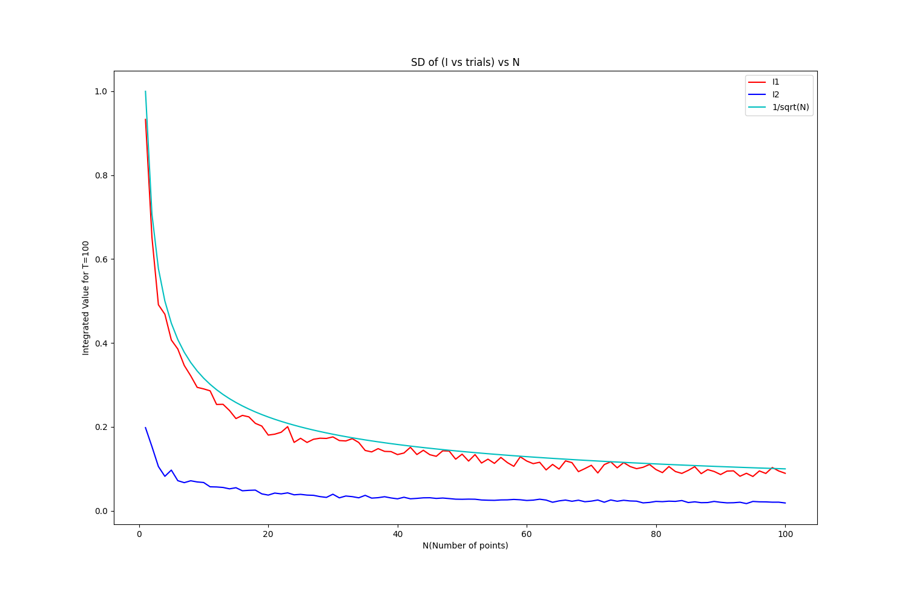
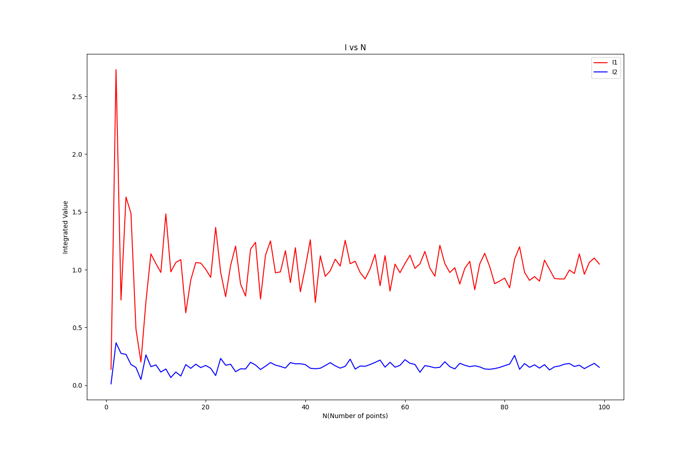
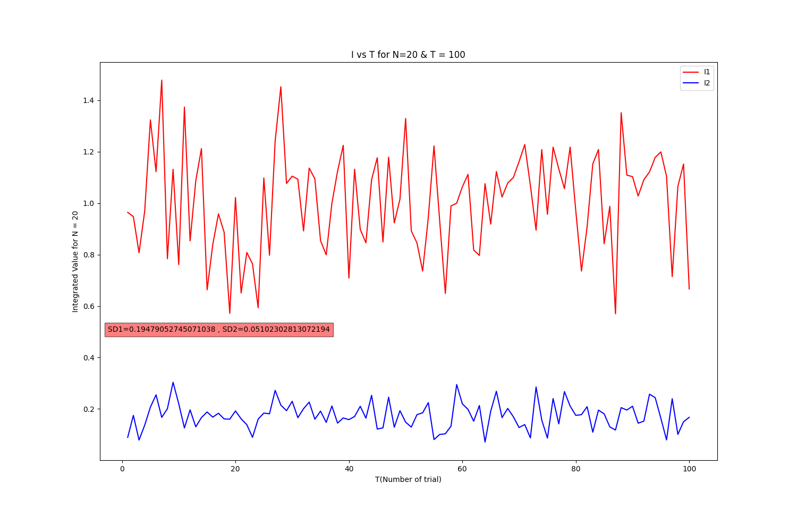
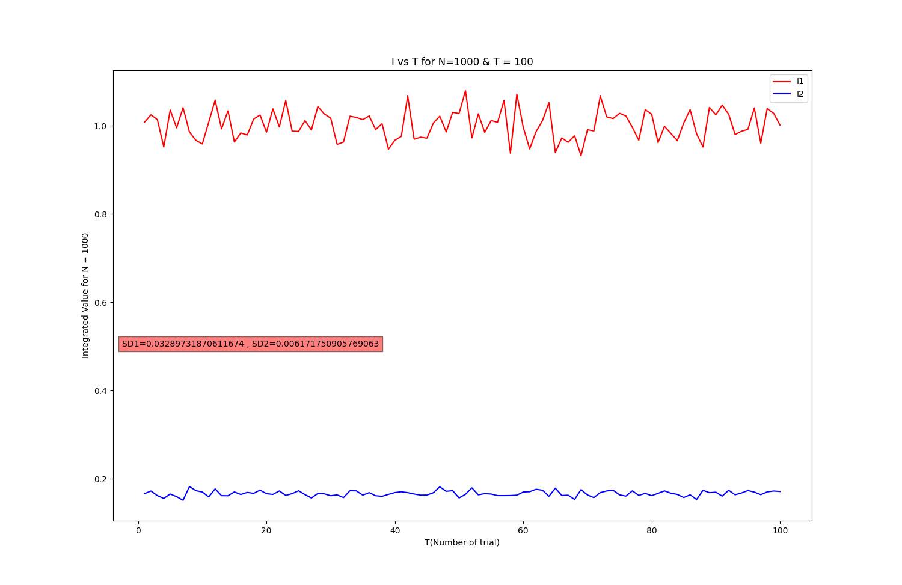

# Integration using Monte Carlo 

Table of content :-
* Method Applied
* How to execute?
* observation

**Method Applied :-**

* Consider the integral, ∫ f(x) dx
* Choose N points xi at random with uniform probability within the integration interval [0,1].
* Determine the mean value of fi's.
* Used `numpy` module to calculate mean & variance

**How to execute?**

    Run : `python3 code.py`

Requirements:
* matplotlib
* numpy

**Observation**

I1 = ∫ 3x^2 dx

I2 = ∫ ∫ x^2 y dxdy

We found STD in plot standard deviation (Of I vs trials) vs N to be proportional to 1/sqrt(N) & inversely proportional to sqrt(N).

**I vs N :**

**N=20; 100 trials; Plot I vs trial :**

standard deviation for I1 = 0.21055162686245885 

standard deviation for I2 = 0.04524763453840625

**N=1000; 100 trials; Plot I vs trial :**

standard deviation for I1 = 0.028508889767466874 

standard deviation for I2 = 0.005891726284787438

