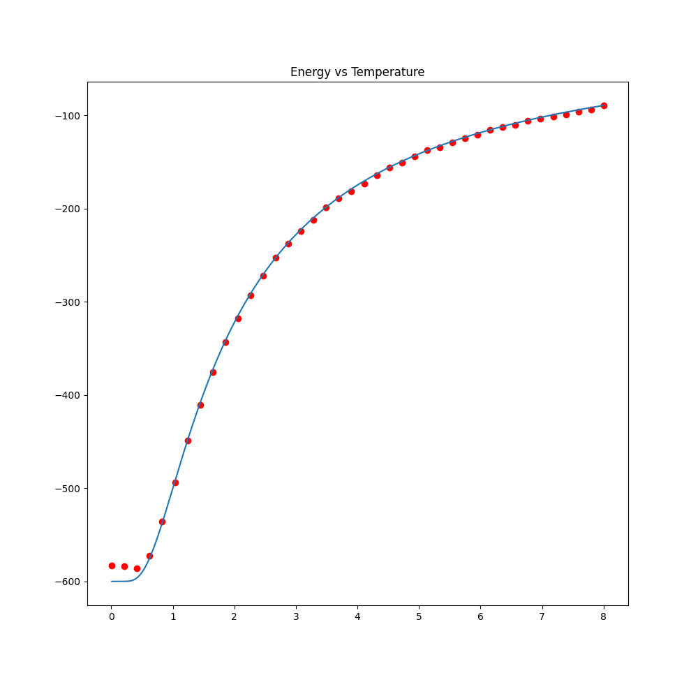
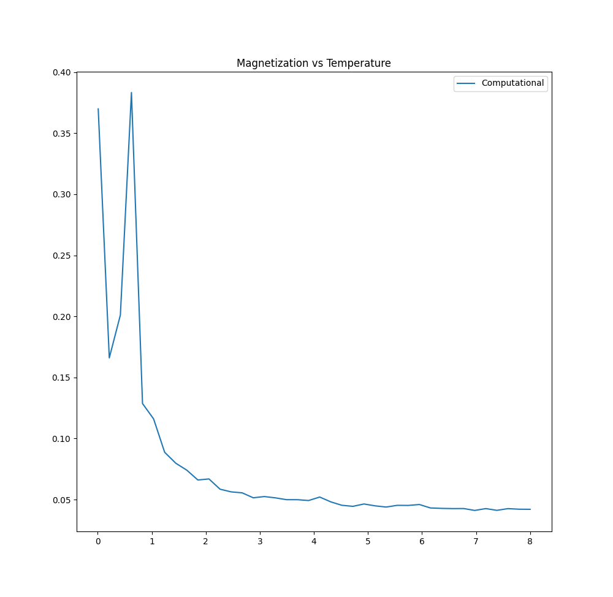

# Ising Model (1D spin system)

Table of Content :

* Code Execution
* Code Flow
* observation from two graph [ E vs T ] & [ M vs T ].

**Executing the code :**

    Run command : `python3 code.py`

**Output :**

There will be a graph output for each graph call as discussed in observation section.

Time of simulation : ~1-2 minutes

## Code Flow

1. Made 1-D NP array with spin value 1 or -1 f size N.

2. Calculated Initial energy of system using equation mentioned in the question.

3. Loop iteration = ~500000 rounds.

4. In each iteration choose a random integer between 0 to N-1 it can be done using np.random.randint(0,N). and find the value of the spin regarding this index(let say ith spin is selected) which is σμi = Spin_array[i]. Then calculate change in energy.

5. Now if the change in energy is less, accept it. If change in energy is more, accept it with probability e^(-dE/T)

6. Repeat the process till equilibrium is reached. Magnetization is average of all the spins.

## Observation 

Overall we observe that :-

* Energy increases with temperature.
* Magnetization decreases with temperature.

More explanation :-

### Energy vs Temperature Graph

* Dotted - Computational

* otherone - Analytical

As the temperature increased, the energy of the system began to increase. This was because as the temperature was increased, thermal effects become more and more important and the system wants to go to the most 
entropically favorable state. So even though though the energy due to the spin-spin interactions is increasing, it is still more favorable to the system to go to the most disordered state.

### Magnetisation vs Temperature Graph

At temperatures from around T = 1 − 10 the magnetization of the system is very close to zero. This makes sense because the 1D Ising model is not supposed to have a phase transition, and the material is supposed to be paramagnetic. At temperatures lower than T ≈ 1 though, the magnetization is M ≈ 1, so there appears to be a phase transition somewhere around
here.

For very low temperatures the magnetization is always M = 1 and also for extremely low temperatures the energy is always E = −1, which is the energy of the system when all the spins are aligned.