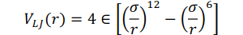

# Science-2 Project Part A

## Lennard Jones Argon Atom-Normal Analysis

* Ayush Sharma
* 2019101004

Table of Content:

* Intro
* Requirements & code Execution & File structure
* Random initial configuration generation.
* Calculating `LJ Potential` of the generated System.
* Finding  minimum energy configuration of generated system.
* Hessian Matrix calculation with Eigen vectors & Eigen values
* Plotting Vibrational Frequencies

## Intro

Analysing the Normal Modes of an Argon System of 108 atoms following the Lennard Jones Potential. The code generates a initial random configuration of 108 atoms based on the given conditions, implements Periodic Boundary Conditions, Reduces the system of the random configuration using the Steepest Descent Algorithm for minimisation, then it generates a Hessian Matrix , and the eigen values and eigen vectors for it. It also plots a histogram of the frequencies. 

This project accounts for analysing Normal mode of an Argon system of 108 atoms. The project implements the following things:-


* Random initial configuration generation.
* Calculating `LJ Potential` of the generated System.
* Finding  minimum energy configuration of generated system (Using Steepest Descent Algorithm)
* Hessian Matrix calculation with Eigen vectors & Eigen values
* Plotting Vibrational Frequencies

For detailed report refer `Report.pdf`

## Requirements & code Execution & File structure

**Requirements :**

```
    numpy
    matplotlib
    tqdm
    autograd
    multiprocessing
    functools
```

**Code Execution :**

**Note:** Move to `codes` folder before executing any command.

For each part of the project (total 5), a file has been written (nammed for same) with one other `configuration.py` file.

| Part |  Execute command    | Files Required     | Output                         |
| -    | -                   | -                  | -                              |
| 1 | python3 q1.py | `q1.py`, `configuration.py` | File `init_conf.xyz` |
| 2 | python3 q2.py | `q2.py`, `configuration.py`, `init_conf.xyz` | Prints LJ Potential |
| 3 | python3 q3.py | `q3.py`, `configuration.py`, `init_conf.xyz` | File `gradient_descent_log.txt`, `final_conf.xyz` |
| 4 | python3 q4.py | `q4.py`, `configuration.py`, `final_conf.xyz`| File `hessian.dat`, `eigen_value.dat`, `eigen_vectors.dat` |
| 5 | python3 q5.py | `q5.py`, `hessian.dat` | Image for Histogram for vibrational Frequency and File `modes.xyz` |


**File Structure :**

```
├── codes
│   ├── checker_files.py
│   ├── configuration.py
│   ├── outputs
│   │   ├── eigen_values.dat
│   │   ├── eigen_vectors.dat
│   │   ├── final_conf.xyz
│   │   ├── gradient_descent_log.txt
│   │   ├── hessian.dat
│   │   ├── init_conf.xyz
│   │   ├── modes.xyz
│   │   └── vibration_frequency.png
│   ├── q1.py
│   ├── q2.py
│   ├── q3.py
│   ├── q4.py
│   └── q5.py
├── README.md
├── README.pdf
├── Report.pdf
└── Requirements.txt
```


**Outputs :**


Following is the explanation of what each output contains:-

- `outputs` : This folder contains all files for project submission.
  - `init_conf.xyz`- The initial random configuration in the xyz format.
  - `gradient_descent_log.txt` - Total potenial log while doing potential/energy minization of initial configuration using the steepest descent algorithm.
  - `final_conf.xyz` - The final molecule configuration after minimisation.
  - `eigen_values.dat`- The eigen values for the submission.
  - `eigen_vectors.dat`- The eigen_vectors corresponding to these.
  - `hessian.dat`- The hessian matrix as part of the submission
  - `modes.xyz`- The final normal modes of the system after all calculations in the xyz format. The format is decribed in report.
  - `vibration_frequency.png` - The histogram as part of submission


## Random initial configuration generation.

**Given:**

* 𝑁 = 108 (initial number of atoms)
* 𝐿<sub>x</sub> = 𝐿<sub>y</sub> = 𝐿<sub>z</sub> = 18 𝐴° (side of the cube)
* ∈=0.238 Kcal/mol (Lennard Jones Energy Parameter)
* 𝜎 = 3.4 𝐴°
* r<sub>ij</sub> (radius)  ≥ 3.4 𝐴°(distance between any two pairs of atoms)

A class for configuration of molecule `Configuration()` has been made in file `configuration.py`, for storing the 3-d coordinates of each of the 108 atoms and calculating their energy described in the next section.

Code for random generation has been done in file `q1.py`. Since, the code is self explanatory as it generates 3-D points for cube  𝐿<sub>x</sub> = 𝐿<sub>y</sub> = 𝐿<sub>z</sub> = 18 𝐴°  s.t. no two points have distance less than r<sub>ij</sub> (radius)  ≥ 3.4 𝐴° (following PBC).

It saves the generated configuration in file `init_conf.xyz` in `outputs` folder.
Following is the inital VMD output for initial configuration:-


## Calculating `LJ Potential` of the generated System.


In this I calculated LJ Potential/Energy of the generated system.
Code for random generation has been done in file `q2.py`. The main function which calculates energy is ( in file `configuration.py` ) :-

```python3
def calculate_potential(self):
    print("Total atoms = ",self.total_atoms)
    pairs = []
    for i in range(self.total_atoms):
        for j in range(i+1, self.total_atoms):
            pairs.append((self.config[i],self.config[j]))
    
    potential = 0
    for (p1, p2) in pairs:
        Rij = norm(self.pbc(p1,p2))
        if Rij!=0:
            val = 4*self.epsilon
            a = self.sigma/Rij
            val = val*( a**12 - a**6 )
            potential += val
    return potential
```

Basically I did the summation of interaction energy per pair, which is as follows:-




The output for the submittedmolecule is: <b>-152.47234949736315</b>

## Finding  minimum energy configuration of generated system.


Following is the ifinal VMD output for final configuration:-


## Hessian Matrix calculation with Eigen vectors & Eigen values


## Plotting Vibrational Frequencies


