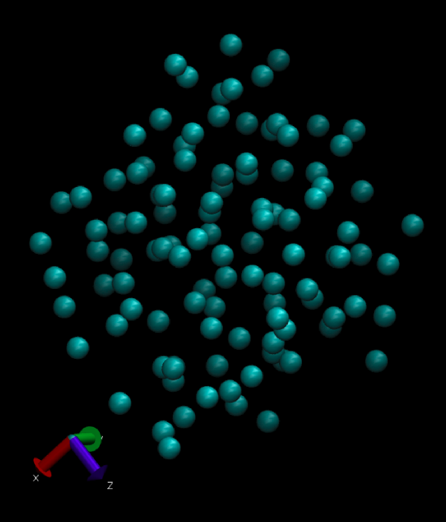

# Science-2 Project Part A

## Lennard Jones Argon Atom-Normal Analysis

* Ayush Sharma
* 2019101004

Table of Content:

* Intro
* Requirements & code Execution & File structure
* Random initial configuration generation.
* Calculating `LJ Potential` of the generated System.
* Finding  minimum energy configuration of generated system.
* Hessian Matrix calculation with Eigen vectors & Eigen values
* Plotting Vibrational Frequencies

## Intro

Analysing the Normal Modes of an Argon System of 108 atoms following the Lennard Jones Potential. The code generates a initial random configuration of 108 atoms based on the given conditions, implements Periodic Boundary Conditions, Reduces the system of the random configuration using the Steepest Descent Algorithm for minimisation, then it generates a Hessian Matrix , and the eigen values and eigen vectors for it. It also plots a histogram of the frequencies. 

This project accounts for analysing Normal mode of an Argon system of 108 atoms. The project implements the following things:-


* Random initial configuration generation.
* Calculating `LJ Potential` of the generated System.
* Finding  minimum energy configuration of generated system (Using Steepest Descent Algorithm)
* Hessian Matrix calculation with Eigen vectors & Eigen values
* Plotting Vibrational Frequencies

For detailed report refer `Report.pdf`

## Requirements & code Execution & File structure

**Requirements :**

```
    numpy
    matplotlib
    tqdm
    autograd
    multiprocessing
    functools
```

**Code Execution :**

**Note:** Move to `codes` folder before executing any command.

For each part of the project (total 5), a file has been written (nammed for same) with one other `configuration.py` file.

| Part |  Execute command    | Files Required     | Output                         |
| -    | -                   | -                  | -                              |
| 1 | python3 q1.py | `q1.py`, `configuration.py` | File `init_conf.xyz` |
| 2 | python3 q2.py | `q2.py`, `configuration.py`, `init_conf.xyz` | Prints LJ Potential |
| 3 | python3 q3.py | `q3.py`, `configuration.py`, `init_conf.xyz` | File `gradient_descent_log.txt`, `final_conf.xyz` |
| 4 | python3 q4.py | `q4.py`, `configuration.py`, `final_conf.xyz`| File `hessian.dat`, `eigen_value.dat`, `eigen_vectors.dat` |
| 5 | python3 q5.py | `q5.py`, `hessian.dat` | Image for Histogram for vibrational Frequency and File `modes.xyz` |


**File Structure :**

```
├── codes
│   ├── checker_files.py
│   ├── configuration.py
│   ├── outputs
│   │   ├── eigen_values.dat
│   │   ├── eigen_vectors.dat
│   │   ├── final_conf.xyz
│   │   ├── gradient_descent_log.txt
│   │   ├── hessian.dat
│   │   ├── init_conf.xyz
│   │   ├── modes.xyz
│   │   └── vibration_frequency.png
│   ├── q1.py
│   ├── q2.py
│   ├── q3.py
│   ├── q4.py
│   └── q5.py
├── README.md
├── README.pdf
├── Report.pdf
└── Requirements.txt
```


**Outputs :**


Following is the explanation of what each output contains:-

- `outputs` : This folder contains all files for project submission.
  - `init_conf.xyz`- The initial random configuration in the xyz format.
  - `gradient_descent_log.txt` - Total potenial log while doing potential/energy minization of initial configuration using the steepest descent algorithm.
  - `final_conf.xyz` - The final molecule configuration after minimisation.
  - `eigen_values.dat`- The eigen values for the submission.
  - `eigen_vectors.dat`- The eigen_vectors corresponding to these.
  - `hessian.dat`- The hessian matrix as part of the submission
  - `modes.xyz`- The final normal modes of the system after all calculations in the xyz format. The format is decribed in report.
  - `vibration_frequency.png` - The histogram as part of submission


## Random initial configuration generation.

**Given:**

* 𝑁 = 108 (initial number of atoms)
* 𝐿<sub>x</sub> = 𝐿<sub>y</sub> = 𝐿<sub>z</sub> = 18 𝐴° (side of the cube)
* ∈=0.238 Kcal/mol (Lennard Jones Energy Parameter)
* 𝜎 = 3.4 𝐴°
* r<sub>ij</sub> (radius)  ≥ 3.4 𝐴°(distance between any two pairs of atoms)

A class for configuration of molecule `Configuration()` has been made in file `configuration.py`, for storing the 3-d coordinates of each of the 108 atoms and calculating their energy described in the next section.

Code for random generation has been done in file `q1.py`. Since, the code is self explanatory as it generates 3-D points for cube  𝐿<sub>x</sub> = 𝐿<sub>y</sub> = 𝐿<sub>z</sub> = 18 𝐴°  s.t. no two points have distance less than r<sub>ij</sub> (radius)  ≥ 3.4 𝐴° (following PBC).

It saves the generated configuration in file `init_conf.xyz` in `outputs` folder.
Following is the inital VMD output for initial configuration:-




## Calculating `LJ Potential` of the generated System.


In this I calculated LJ Potential/Energy of the generated system.
Code for random generation has been done in file `q2.py`. The main function which calculates energy is ( in file `configuration.py` ) :-

```python3
def calculate_potential(self):
    print("Total atoms = ",self.total_atoms)
    pairs = []
    for i in range(self.total_atoms):
        for j in range(i+1, self.total_atoms):
            pairs.append((self.config[i],self.config[j]))
    
    potential = 0
    for (p1, p2) in pairs:
        Rij = norm(self.pbc(p1,p2))
        if Rij!=0:
            val = 4*self.epsilon
            a = self.sigma/Rij
            val = val*( a**12 - a**6 )
            potential += val
    return potential
```

Basically I did the summation of interaction energy per pair, which is as follows:-


The output for the submittedmolecule is: <b>-152.47234949736315</b>

## Finding  minimum energy configuration of generated system.

In this part we minimises the total energy of system w.r.t PBC using steepest descend algo.

**PBC(Periodic Boundary Condition) :**

These are boundary condition for approximating large system by focusing on it's small part i.e. unit cell.

Following function account for the same & calculates distance to the nearest mirror image in the simulation :-

```python3
def pbc(point1, point2):
    L = 18
    mod_length = (point2 - point1) % L # The image in the first cube
    return ((mod_length+L/2)%L)-L/2 # MIC separation vector
```
As a result, there is no need to verify the boundary conditions during the updating of the atom's coordinates. I convert the out of bound coordinates to inside the box as required when placing the solution in `final_conf.xyz`.

**Steepest Descend Algorithm :**

* Heuristics:-
    1. iteration_heuristic = 200
    2. alpha_heuristic = 0.135


**Logic of Code :**

* Used library `autograd` for faster calculation than `numpy`. It also posses numpy operations.
* Used `gradient` function from `autograd` for getting slope at given point.
* In `for` loop I stored the cost i.e. energy & weight i.e. configuraton of the system.
* Finaly, printedstored final conf. in file `final_conf.xyz` and looged the energy at each step in file `gradient_descent_log.txt`.

Code for steepest descent algo in `q3.py`:- 

```python3
iteration_heuristic = 200
alpha_heuristic = 0.135
for i in tqdm(range(iteration_heuristic)):
    new_config -= alpha_heuristic*gradient(new_config)
    weight_history.append(new_config)
    cost_history.append(calculate_potential(new_config))
```

Following is the final VMD output for final configuration:-


## Hessian Matrix calculation with Eigen vectors & Eigen values

File `q4.py` accounts for Hessian matrix calculation & eigen vectors & values with class `Hessian` solely. 

The file took atleast 50 minutes to run. So used `Pool()` for multiprocessing which reduces it to around 27 minutes and got the hessian matrix. 

Used numpy library funtions for eigen balues & vectors.

The hassien matrix, eigen values  & eigen vectorsis saved in `hassien.py`, `eigen_values.dat` and `eigen_vectors.dat` respectively.

Formula used :-


## Normal mode & Plotting Vibrational Frequencies

For diagonal mass-weighted hessian matrix, we have sum of harmonic oscillator hamiltonians, whic can be done by choosing normal coordinates =  {q1, . . . , q3N }.

As hessian is real & symmetric, ti can be orthogonalised using real orthogonal matrix as followin.


where Q are eigen vectors.

Back-tranforming to un-mass waighted cartesian space gives the normal modes of the system.

**Normal modes** are written in file `mode.xyz`. Format is:-


**Histogram Plot :**

Some modes are very high in number while others are very low. 

